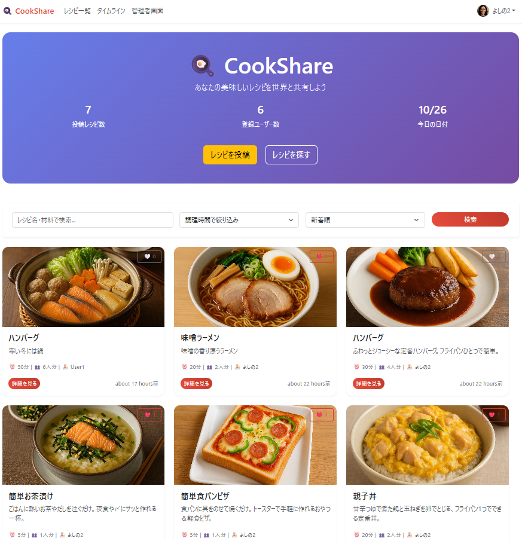
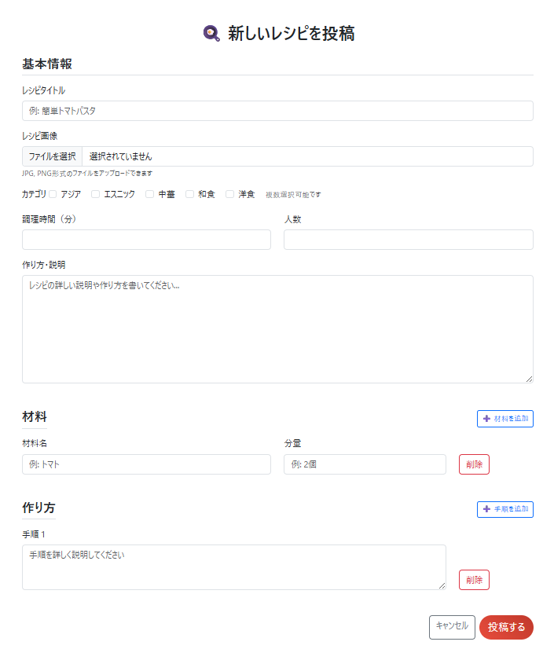
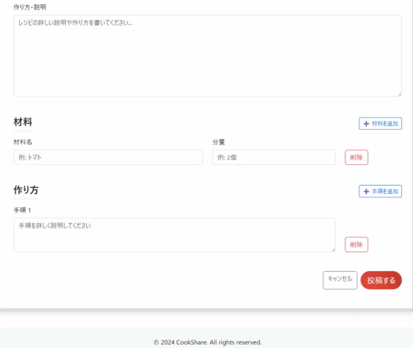
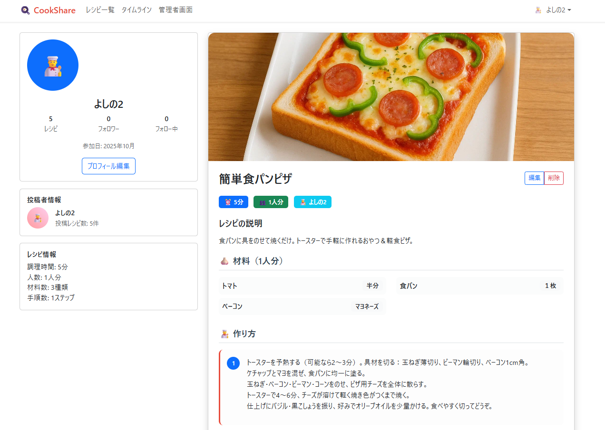
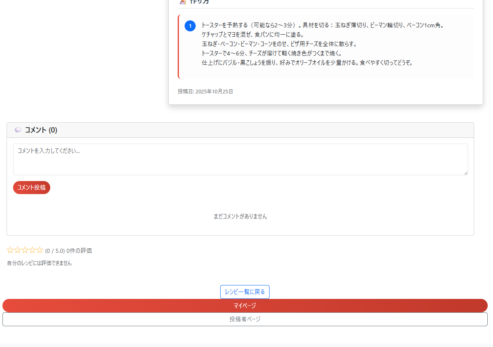
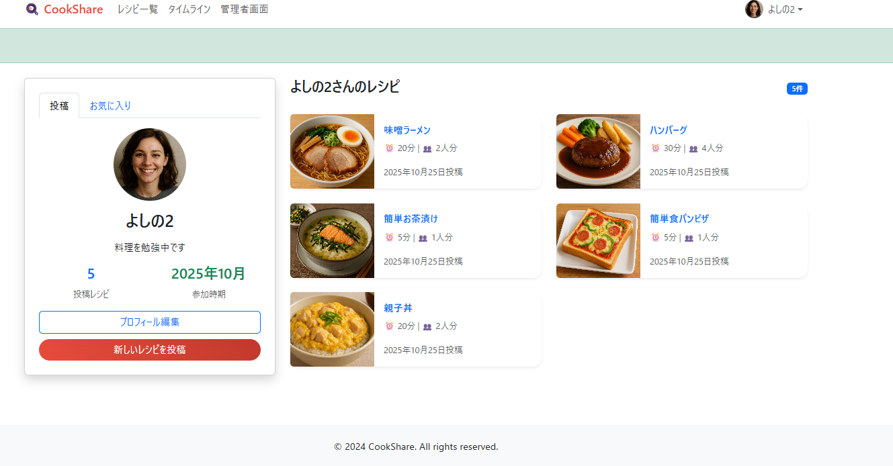
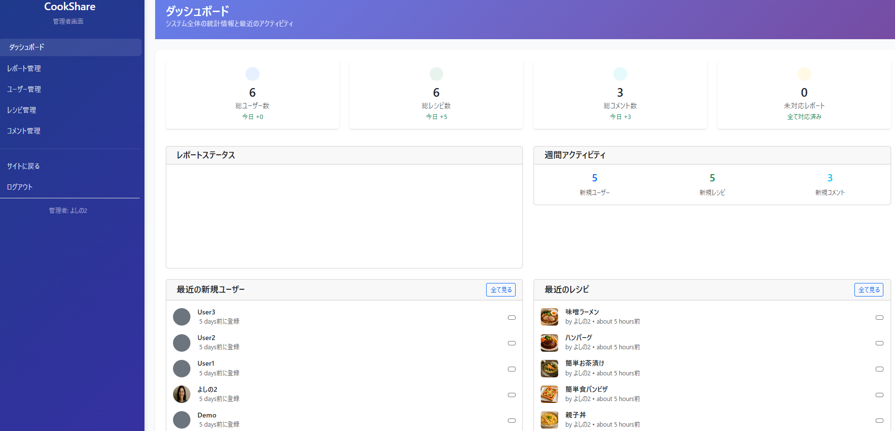
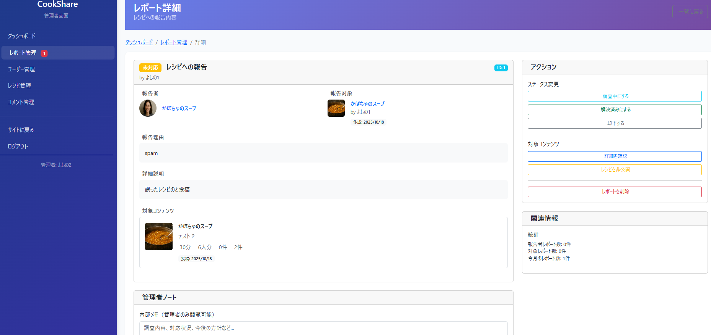

# README
# 🍳 CookShare

**設計・テスト・保守性を意識して構築した、レシピ共有SNSアプリ**

家庭料理を中心に、**レシピをSNS感覚で共有・交流できる**Webアプリです。  
料理初心者・主婦層・レシピを記録したい人を対象に、  
「同じ趣味・趣向の人と気軽につながれる場」を目指しています。

URL: [https://cookshare-ygta.onrender.com/](https://cookshare-ygta.onrender.com/)

---

## 📘 アプリ概要（目的・対象・できること）

**CookShare** は、料理を通じて人とつながるSNSです。  
ユーザーは自分のレシピを投稿し、他の人の投稿を閲覧・コメント・お気に入り登録できます。  
管理者機能や通報システムを備え、安全なコミュニティ運営を実現しています。

- 👩‍🍳 **対象ユーザー**  
  - 料理初心者、主婦層、料理を趣味とする一般ユーザー  
  - 自分のレシピを記録・共有したい人  
  - 同じ趣味を持つ人と交流したい人

- 🎯 **このアプリでできること**  
  - レシピの投稿・検索・評価・コメント  
  - お気に入り登録・フォローによる交流  
  - 管理者による違反通報の確認・対応  
  - 自分の料理記録として活用可能

- 💡 **開発の目的**  
  - Ruby on RailsによるフルスタックWeb開発を体系的に学習  
  - 設計・テスト・保守を意識した開発プロセスの実践  
  - 技術理解と再現性のある設計力の向上
---

## 🚀 URL情報

| 種類 | URL |
|------|------|
| **アプリURL** | https://cookshare-ygta.onrender.com/ |
| **GitHubリポジトリ** | https://github.com/yosino26?tab=repositories |

> ※テストアカウント  
> ：user1@example.com / userpass1

---

## 🛠 使用技術

| カテゴリ | 技術 |
|-----------|------|
| 言語/フレームワーク | Ruby **3.2.0** / Rails **7.1.5.1** |
| フロントエンド | Bootstrap **5.3.5** / Turbo **2.0.16** / Stimulus **1.3.4** / Importmap-rails **2.2.2** |
| データベース | PostgreSQL **14.18（psql client）** / pg **1.6.1** |
| 認証 | Devise **4.9.4** |
| ストレージ | Active Storage / aws-sdk-s3 **1.200.0** / image_processing **1.14.0** / mini_magick **5.3.0** |
| デプロイ | Render |
| その他 | RSpec Rails **7.1.1** / FactoryBot Rails **6.5.0** / Shoulda Matchers **5.3.0** / Faker **3.5.2** / Kaminari **1.2.2** / kaminari-bootstrap **3.0.1** / Puma **6.6.1** |

---

## 🔧 機能一覧

| 分類 | 機能 | 状況 |
|------|------|------|
| ユーザー | 登録・ログイン（Devise） | ✅ |
| | プロフィール編集 | ✅ |
| | フォロー / フォロワー機能 | ✅ |
| レシピ | 投稿・編集・削除 | ✅ |
| | 画像アップロード（ActiveStorage） | ✅ |
| | 材料・手順の動的フォーム | ✅ |
| | カテゴリ分類 / 検索 | ✅ |
| インタラクション | お気に入り / コメント / 評価(★1〜5) | ✅ |
| 管理機能 | 管理者ダッシュボード | ✅ |
| | 通報管理（一般ユーザー・管理者） | ✅ |
| | ユーザー / レシピ / コメント管理 | ✅ |
| テスト | モデル / バリデーション / 一意制約テスト | ⏳進行中 |

---

## 🧩 開発プロセス（課題と解決）

CookShareの開発では、Railsの標準機能に加えて、  
フォロー機能・お気に入り機能・カテゴリ検索・動的フォーム・通報管理など  
カリキュラム外の要素を積極的に取り入れました。  
各機能の実装において発生した課題と、その解決プロセスを以下にまとめています。

| 課題 | 解決方法 | 学んだこと |
|------|-----------|-------------|
| 管理者専用画面でアクセス制御が正しく動作しなかった | `Admin::BaseController` を導入し、共通認証処理をまとめて継承する構造へ変更 | 名前空間の設計と継承構造の理解 |
| 通報機能（Polymorphic関連）の関連付けでエラーが多発 | モデル間の関連を見直し、`belongs_to :reportable, polymorphic: true` を採用。AIツールを用いて仕組みを分解しながら再設計 | Polymorphic設計の理解・ActiveRecordの柔軟性 |
| ActiveStorageで画像が正しく表示されない | `storage.yml` の設定差異を洗い出し、Render環境とローカル環境でのサービス設定を明確化 | 環境変数とサービス設定の重要性 |
| N+1クエリによるパフォーマンス低下 | 管理画面で `includes(:user, :favorites, :comments)` を適用し、関連データを事前読込 | パフォーマンス最適化とクエリチューニング |
| 材料・手順の動的フォームでJavaScriptエラー | `fields_for` と `nested_form_fields` の使い分けを理解し、DOM構造とイベントを整理 | 動的フォーム構築の仕組みとイベント伝搬の理解 |
| 管理者ダッシュボードでステータス変更が反映されない | `link_to ... method: :patch` に `data: { turbo_method: :patch }` を付与し、Turbo環境での非同期通信を正しく処理 | Rails7 + Turboの通信仕様の理解 |
| 新機能追加（フォロー・お気に入り・カテゴリ分類など）の仕組み理解が難しかった | AIツールを活用しながら、関連モデル・ルーティング構造を可視化して再現・調整 | 新技術を自走的に吸収する力とリファレンス読解力 |

---

## 💡 工夫・こだわりポイント

- **管理画面の設計**  
  - 管理者専用の`Admin`名前空間を設け、アクセス制御を明確化。  
  - ダッシュボードに「未対応通報数バッジ」を実装し、運営効率を向上。

- **通報機能（Phase 32–33）**  
  - Polymorphic設計で `User / Recipe / Comment` のいずれも通報可能に。  
  - 状態管理を `enum` で管理（`pending / investigating / resolved / dismissed`）。

- **保守性を意識した構成**  
  - モデル間の依存を `Concern`（例：Reportable）に切り出し再利用性を向上。  
  - バリデーションやenum定義を明確化して不整合を防止。  
  - N+1問題対策として `includes` を徹底。

- **テストコード導入**  
  - FactoryBotとShoulda-Matchersを利用し、バリデーション・関連・一意制約を自動テスト。  
  - Phase 34ではController・Systemテストも拡充予定。

---

## 🖱️ 使い方（操作手順）

CookShareは、家庭料理を共有し、他のユーザーと交流できるSNS型レシピアプリです。  
以下では、主な機能の操作手順を画面とともに紹介します。

---

### 🏠 トップページ（レシピ一覧）


ログイン後、最新のレシピが一覧表示されます。  
カード形式でレシピタイトル・投稿者・お気に入り数などが確認でき、  
各投稿から詳細ページ・お気に入り・通報操作が可能です。

---

### ✍️ レシピ投稿フォーム



「＋新しいレシピを投稿」から、タイトル・説明・画像を登録します。  
材料・手順は動的フォームで自由に追加／削除でき、視覚的に分かりやすいUIを採用しています。  
画像を添付して、オリジナルレシピを簡単に共有できます。

---

### 🍲 レシピ詳細ページ



投稿されたレシピの詳細情報を閲覧できます。  
コメント投稿・お気に入り登録・評価（★1〜5）などの操作が可能で、  
ユーザー同士のコミュニケーションを促進します。

---

### 🔍 検索・カテゴリ機能


調理時間やキーワードでレシピを絞り込めます。  
部分一致検索によって目的のレシピをスムーズに探せます。  
非同期検索を導入し、ユーザー体験を向上させています。

---

### 👤 ユーザープロフィールページ


各ユーザーのプロフィールを表示します。  
フォロー／フォロワーリストを確認でき、気になるユーザーをフォローして交流が可能です。  
プロフィール編集機能も備えています。

---

### 🛠️ 管理者ダッシュボード


管理者ユーザーでログインするとアクセス可能な専用ダッシュボードです。  
登録ユーザー・レシピ・コメント・通報などの管理を行えます。  
未対応通報数は赤バッジで表示され、運営状況を一目で把握できます。

---

### 🚨 通報管理画面


一般ユーザーから送信された通報内容を一覧で確認し、  
「調査中」「解決済み」「却下」などのステータス管理が可能です。  
通報対象（ユーザー／レシピ／コメント）に直接遷移して対応を行えます。


## 🧪 テスト状況（実施済み・進行中）

### ① モデルテスト（Model Specs）
- Favorite：`user×recipe` 一意  
  - `spec/models/favorite_spec.rb`
- Follow：`follower×following` 一意／**自己フォロー禁止**（nilガード）  
  - `spec/models/follow_spec.rb`
- Rating：`score` は **1〜5**（境界：1/5 OK、0/6 NG）／`user×recipe` 一意  
  - `spec/models/rating_spec.rb`
- Comment：`content` 必須／**空白のみNG**／レシピ削除で巻き添え削除  
  - `spec/models/comment_spec.rb`
- RecipeCategory：`recipe×category` 一意  
  - `spec/models/recipe_category_spec.rb`
- Report：`enum` 値集合、`pending`（未対応のみ）／`recent`（**created_at desc, id desc**で安定）  
  - `spec/models/report_spec.rb`

### ② DBテスト（Constraints 実効性）
- 一意インデックスの実効性を `insert_all!` で検証（`RecordNotUnique`）  
  - 対象：favorites / follows / ratings / recipe_categories  
  - `spec/db/constraints_spec.rb`
- FK/依存削除の実効性（親 destroy 時に残骸なし）  
  - `spec/models/comment_spec.rb` の差分検証

### ③ スコープ・一覧表示（Request / API）
- **recent順の安定**（`created_at desc, id desc`）  
- **ページ跨ぎ重複なし**（1ページ=12件想定）  
- **カテゴリ絞り込み**で該当のみ返る  
  - `spec/requests/api/recipes_index_spec.rb`
  - 利用スコープ：`Recipe.recent` / `Recipe.by_category` / `Recipe.published`  
  - API：`GET /api/recipes`（`id,title,created_at` をJSON返却）

### ④ アクセス制御（認可）／リクエスト層
- 管理画面：admin のみ許可、一般は 302/403  
  - `spec/requests/admin_access_spec.rb`
- 所有権：他人レシピの編集/更新を拒否  
  - `spec/requests/recipe_ownership_spec.rb`
- 評価：**自分のレシピは評価不可**／`score` は **1..5 にクランプ**  
  - `spec/requests/ratings_controller_spec.rb`  
  - 実装補強：`RatingsController` に `authenticate_user!` / `reject_own_recipe!` / `clamp(1,5)`

### ⑤ システムテスト（System / E2E）
- ハッピーパス：**投稿 → 表示 → コメント → お気に入り → 評価**  
  - `spec/system/recipe_happy_path_spec.rb`
- マイページ：**投稿／お気に入り**のタブ切替表示  
  - `spec/system/mypage_tabs_spec.rb`
- 設定：Capybara（`rack_test` / `selenium headless` 切替）、画像フィクスチャ  
  - `spec/support/capybara.rb` / `spec/fixtures/files/sample.jpg`

### ⑥ CI（自動実行）
- GitHub Actions で RSpec を自動実行（Chrome 追加で System Spec も走行）  
  - `.github/workflows/rspec.yml`

## 🧪 テスト・品質保証（Phase 34予定）

- Model単体テスト  
- Controller権限制御テスト  
- Systemテスト（通報フロー / 管理画面操作）  
- CSRF/XSS/SQL Injection対策確認  
- パフォーマンス最適化（N+1 / Index確認）

---

## 🌱 今後の展望

- コメント通報機能の追加（User / Recipeに加えて Comment）
- SNS共有・印刷機能の追加
- Active Storage × S3 連携による本番運用化
- アクセシビリティ対応・UI改善
- React導入（段階的）
  - Option A: React Islands（vite_ruby + react）— 検索・いいね一覧をReact化
  - Option B: 部分SPA（マイページ/管理 + react-router-dom）
  - Option C: 完全SPA（RailsをAPI化：jbuilder/jsonapi-serializer + OpenAPI）
- 検索強化：pg_trgm + pg_search（部分一致/類似） or Meilisearch
- タグ機能：acts-as-taggable-on（タグ×カテゴリの複合検索・関連提


---

## 👤 作者情報

| 項目 | 内容 |
|------|------|
| **名前** | 溝内 慎吾 |
| **学習歴** | 2024年10月〜現在（約1年） |
| **使用環境** | Windows 11 + Ubuntu (WSL2) |
| **目標** | 設計と品質を重視したWebアプリ開発ができるエンジニアを目指しています。 |

---

## 🗂 ディレクトリ構成（抜粋）

```text
app/
├── controllers/
│   ├── admin/                 # 管理者画面
│   ├── reports_controller.rb  # 通報UI
│   ├── recipes_controller.rb
│   ├── comments_controller.rb
│   ├── favorites_controller.rb
│   └── follows_controller.rb
├── models/
│   ├── concerns/
│   │   └── reportable.rb
│   ├── report.rb
│   ├── recipe.rb
│   └── user.rb
└── views/
    ├── admin/
    ├── reports/
    ├── recipes/
    └── users/


このプロジェクトは個人ポートフォリオ目的で作成されています。
学習・面接資料としての利用を目的としています。